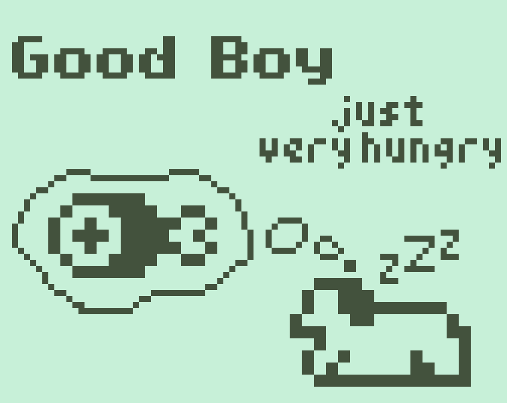
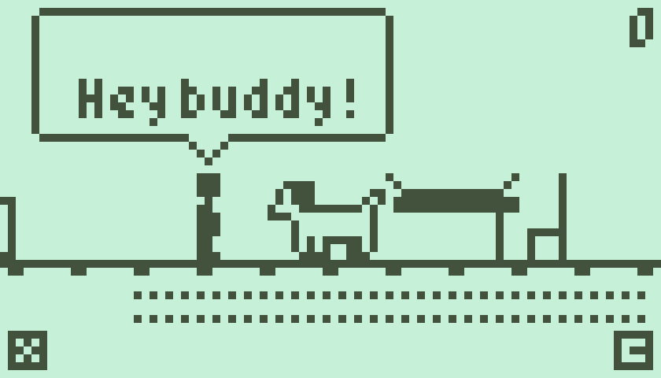
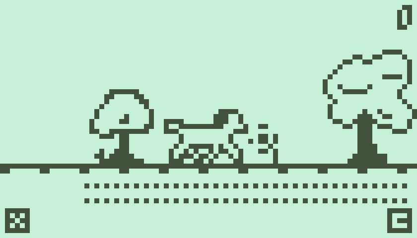
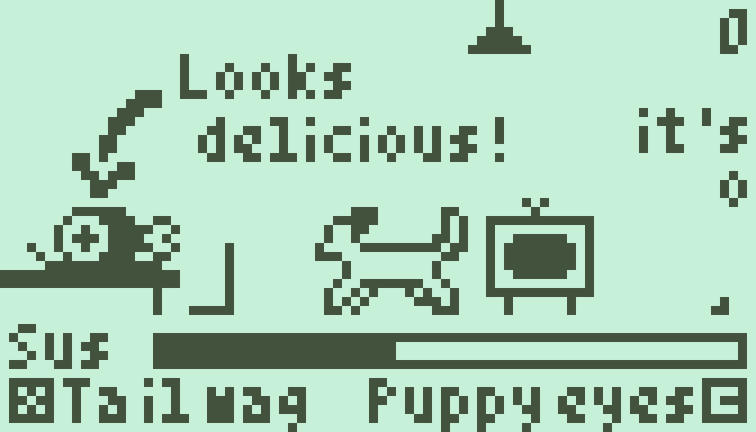

# Good Boy... just very hungry

A game made for the [Nokia 3310 Jam 5](https://itch.io/jam/nokiajam5).

Play it on itch.io: https://gheja.itch.io/good-boy-just-very-hungry

I made this game over the course of about 4 days, and this is my first real Godot game, it shows on the code, I am aware of it.

## About

Controls on keyboard:
  - Arrow keys - move
  - X - left action (shown on screen)
  - C - right action (shown on screen)
  - M - mute music

Also should work with controllers/gamepads.

Credits:
  - Sounds: Trix ([Nokia 3310 Jam Resources](https://phillipp.itch.io/nokiajamresources))
  - Music: Avgvsta ([50 MIDI tunes on opengameart.org](https://opengameart.org/content/50-midi-tunes)), gheja
  - Small font: Brian Swetland ([Blog](https://robey.lag.net/2010/01/23/tiny-monospace-font.html), [TTF](https://github.com/gheja/tom-thumb-ttf))
  - Big font: Eeeve Somepx ([itch.io page](https://somepx.itch.io/))
  - Code, graphics: gheja

The game is made in Godot, using the great template by Trix on the [Nokia 3310 Jam Resources](https://phillipp.itch.io/nokiajamresources)

## Screenshots

